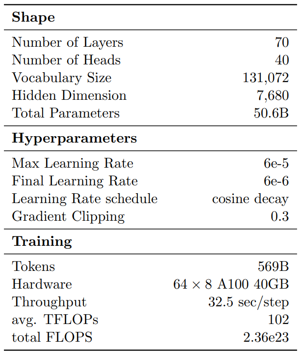
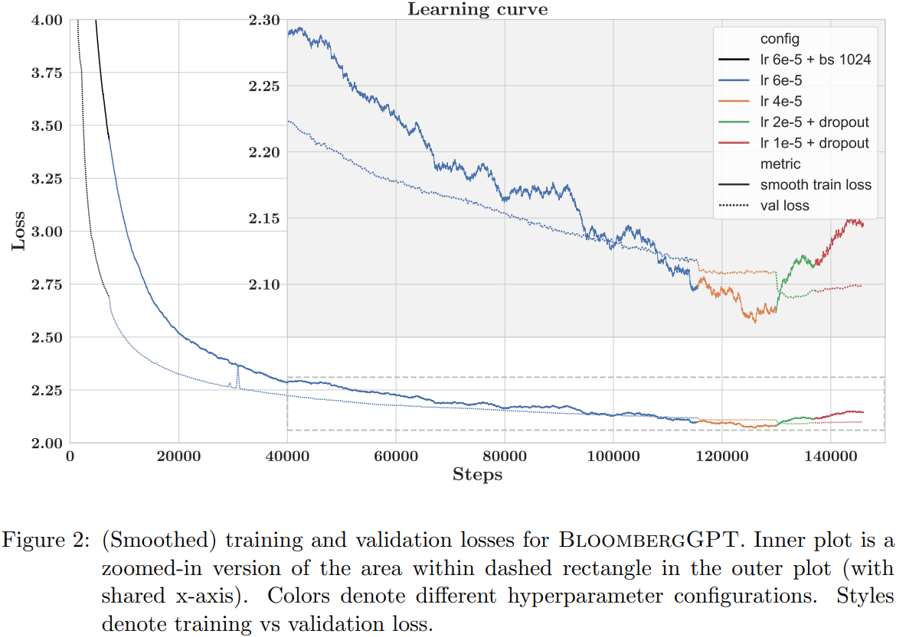

BloombergGPT是布隆伯格2023年3月30日公开在arXiv的一篇文章——[BloombergGPT: A Large Language Model for Finance](https://arxiv.org/abs/2303.17564 "BloombergGPT: A Large Language Model for Finance")中涉及到的语言模型，也是金融领域第一个公开发表文章的大语言模型（以下简称“LLM”）。  
由于原始文章较长，在此我们先就论文中涉及到数据集、模型与训练方面的内容做一下介绍。

# 要点  

- BloombergGPT是Bloomberg训练出来的金融大语言模型（LLM for Finance）  
- 模型**参数量为500亿**，使用了包含**3630亿token的金融领域数据集**以及**3450亿token的通用数据集**
- **隐藏层维度为7680**，多头的**头数为40**
- 模型采用**Unigram tokenizer**，**AdamW**优化器
- 模型在**64个AWS的p4d.24xlarge实例上训练了53天**，其中**每个p4d.24xlarge实例包含了8块40GB的A100GPU**  

# 引言  

**BloombergGPT是一个有500亿参数、基于BLOOM模型的LLM**，过程中采用了一种兼具通用能力和特定领域的方法。  

为了使用这种方法，作者们基于Bloomberg 40年来积累的数据构造了目前最大的金融领域数据集。  

文章的主要贡献在以下几点：
- 混合数据集训练方法不仅可以在特定任务上表现出色，也可以在一般NLP基准测试上表现良好
- 不同于常见的网络爬取数据，本文的数据包含了巨量的可信来源的精心清洗的数据
- 不仅包含了模型在基准测试集上的评估结果，也包含了在Bloomberg内部任务上的评估结果
- 在超过7000亿个token的语料库中的5690亿个token上训练出一个500亿参数的LLM
- 使用Unigram模型而非常用的基于贪心合并的子词标记器进行tokenize，方便在推理时进行更智能的标记化
- 借鉴BLOOM的训练大模型方法，同时也将自己自己在训练BloombergGPT中的经验分享

# 数据集  

**BloombergGPT是一个有500亿参数、基于BLOOM模型的LLM**，过程中采用了一种兼具通用能力和特定领域的方法。  

作者首先**构建了FinPile**——一个包含了新闻、档案、网络爬取的新闻稿件、英文财经文档等英文金融文档的金融领域数据集，同时也采用了通用的数据集。  

## 金融领域数据集  

**金融领域数据集共包含了3630亿个token，占总数据集token量的54.2%**，具体由以下几个部分构成：  

- 金融领域相关网页，2980亿token，占比42.01%  
- 金融领域知名新闻源，380亿token，占比5.31%  
- 公司财报，140亿token，占比2.04%  
- 金融相关公司的出版物，90亿token，占比1.21%  
- bloomberg，50亿token，占比0.7%  

因为包含一部分收费和私有数据，所以这份数据集不会被公开，但是文章中公开了模型训练方法。

## 通用数据集  

**通用数据集共包含了3450亿个token，占总数据集token量的48.73%**，具体分为如下几个部分：  

- The Pile数据集，1840亿token，占比25.9%  
- C4数据集，1380亿token，占比19.48%  
- Wikipedia数据集，240亿token，占比3.35%  

数据集使用**Unigram tokenizer**对原始文本进行tokenize。具体处理时，作者这了**两点改进**（具体内容可参考原论文《2.3Tokenization》）：  

- 在pretokenization这一步，将数字视为单个token，并且允许词组的存在，以提高信息密度减少句子长度  

- 使用分治的思想优化Unigram tokenizer在大数据集上的实现，并对最终**词表大小控制在13万**这个数量级上  

# 模型 

## 模型结构  

模型**基于BLOOM模型的自回归结构**，具体**包含了70层transformer decoder**。  

另外一些细节如下（详见《3.1 Architecture》）：  
- 前馈层（FFN）中的非线性函数采用GELU
- 位置编码采用ALiBi编码
- 模型在第一层多了一个layer normalization

## 模型尺度  

这一部分，作者先有了算力预算（**40G内存A100共130万GPU小时**），并且给中间checkpoint存储留出了约25%的时间预算。  
根据Chinchilla scaling laws，计算出模型的参数和需要的数据量大小——模型参数为500亿，token数据量为11000+亿。  

考虑到金融领域token数量要占总token数量的50%以上，而且目前的数据暂时无法再进行扩充，最终模型参数量选择为500亿，token数据量为7000+亿。

另一方面，隐藏层维度D也可以根据decoder的层数计算出来，这里经过计算**隐藏层维度为7680**，多头的**头数为40**。  

## 训练配置

这一部分原始论文写的比较详细，具体见《3.3 Training Configuration》，这里简单摘要如下：  

- 作者在每篇文档的最后添加了特殊标记<|endoftext|>，模型训练时选取的句子长度为2048token  
- 训练时采用的优化方法是AdamW，beta1、beta2、weight decay取值分别为0.9、0.95、0.1，初始学习率为6e-5，采用cosine衰减、线性warmup方式  
- 模型参数随机初始化为均值0、标准差0.006588的正态分布，并对MLP的第二层和注意力层输出进行缩放  
- 关于训练的不稳定性，文章中没有描述训练BloombergGPT时采用的方法，只是介绍了相关进展  
- 关于计算使用到的硬件，使用了64个AWS的p4d.24xlarge实例，每个p4d.24xlarge实例包含了8块40GB的A100GPU

## 大规模优化采用的方法  

这一部分中，作者描述了具体优化时采用的方法：ZeRO优化、MiCS、Activation Checkpointing、混合精度训练（Mixed Precision Training）、内核融合（fused kernels）。  

具体见《3.4 Large-scale Optimization》  

经过上述优化，上述硬件的**平均算力水平达到了102TFLOPs**，**训练一步需要32.5秒**。

# 训练过程  

损失函数随训练步数变化曲线如下图所示：  

  

文章中记录**模型共训练了139,200步**，进行了约**0.8个epoch**，**训练了53天**。  

一个epoch都没有训练完的原因是这时验证集上的损失函数已经不再继续下降了。

**具体训练过程如下**：  

- 初始训练的batch size大小为1024，warm-up过程持续了7200步，随后作者将batch size修改为2048。
- 115,500步之后，验证集上的损失不再下降，然后作者将学习率缩小为原始的2/3；
- 129,900步之后，学习率缩小为之前的1/2，同时增加dropout
- 137,100步之后，学习率再次缩小为之前的1/2
- 最终，训练在146,000步结束。作者选取139,200这一步的模型最为最终使用的模型  

这里推荐阅读原始文章3.3节与3.4节中关于训练方法的描述，对于大模型训练有一定的参考意义。

关于模型的评估，下一篇文章再详细写一下。
